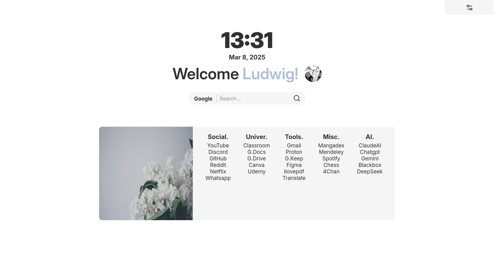

# 📰 <strong>Pageper Startpage</strong>

<strong>Pageper</strong> is a minimalist looking startpage that aims to be as <strong>simple</strong> and customizable <strong>as possible</strong>.<br>
This Project was born as a small side project trying to learn how to use ReactJS. 
<br><br>

<div style="display:grid; place-items: center;">

</div>
<br><br>

## <strong>How to install 💻</strong>

> ### 🧩 Through Firefox Extensions. <br>
Is on the works (:
<br><br>

> ### 📦 Manual with Node Package Manager (npm).<br>
1. Clone this repo with: <br> 
```bash 
git clone https://github.com/twodigitss/pageper.git
```
2. Go inside the cloned directory with: <br> 
```bash
cd pageper
```
3. Make a static version of the project with: <br> 
```bash
npm run build
```
4. If for some reason you had a problem with building, install dependencies with:<br> 
```bash
npm install
```
5. You must have gotten a new directory called `dist`. This directory contains the static files needed. 
```bash
cd dist
```
6. Make sure the following lines are linking the files correctly in `index.html` (the src property must have a dot before the slash) like this.<br>
```html
<script type="module" crossorigin src="./assets/index-CcEXDJ21.js"></script>
<link rel="stylesheet" crossorigin href="./assets/index-C3egy6RG.css">
```

7. Make a reference to the file in `Home -> new windows and tabs -> homepage and new windows`.
Select `Custom Url` and select the path of the file. <br> 
The custom url should look like this:
`file:///home/your_home/pageper/dist/index.html`<br><br>


> NOTE: You cannot access directly to files on firefox. For such, set the next options with its corresponding value in `about:config`.

<br>

| Property                             | value  |
|--------------------------------------|--------|
|security.fileuri.strict_origin_policy | false  |
|browser.search.openintab              | true   |
|browser.urlbar.openintab              | true   |
|browser.tabs.loadBookmarksInTabs      | true   |

    
<br>

## <strong>Get started 🚀</strong>

This Startpage is <strong>managed</strong> through a <strong>`JSON` file</strong> that contains configuration you set on it, like your username and bookmarks. <br>

You have a <strong>example configuration file</strong> located in `src/config/template.json` to start with. <br>

<strong>You can set</strong> your username in the "username" default value <i>(obviously dont replace the "username" key, do replace the "Default" text)</i>. <br>

<strong>To add bookmarks</strong> (or modify them), you edit values on the json file, is as easy as opening a new set of values <strong>inside</strong> the `bookmark` category. The code should look like this:
```json
    //For more information, search about JSON Syntax
    "bookmarks" : {
        "title_of_your_new_category" : {
            "website_name1" : "link_of_the_website",
            "website_name2" : "link_of_the_2nd_website",
            "website_name3" : "link_of_the_3rd_website"
            //is important to DONT put a comma at the last element as i did
        }
        //if your new category is the last on the list, DONT put a comma. 
        //If not, put it, so wont throw you a error

    }
```
Once you have <strong>finished</strong> editing your configuration, go to the extension (or the running page) and <strong>hit the settings icon</strong>. You will see a couple of options, click on <strong>"Upload Configuration"</strong> and the page will reload automatically once the file has done processing. 

<strong>If nothing shows, you probably have a syntax error in your json file</strong>.

Thats pretty much everything for now. Enjoy (:
